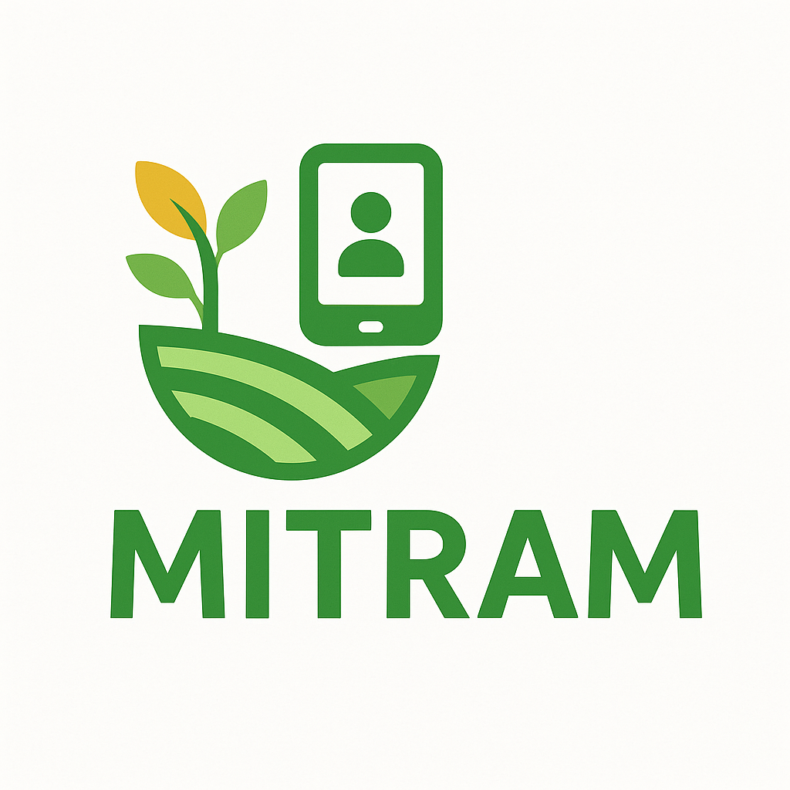

# Mitram: Your Smart Farming Ally



Mitram is a comprehensive Flutter-based mobile application designed to empower Indian farmers with smart farming solutions. It leverages artificial intelligence, real-time data, and user-friendly interfaces to provide valuable agricultural insights and support.

## 🌾 Features

### AI-Powered Crop Disease Diagnosis
- **Instant Disease Detection**: Take or upload a photo of your crop to get an immediate diagnosis of diseases
- **Detailed Analysis**: Receive severity assessment, cause explanation, and treatment recommendations
- **Prevention Tips**: Get actionable advice to prevent future occurrences
- **Weather-Specific Guidance**: Recommendations tailored to current weather conditions
- **Offline Capability**: TensorFlow Lite model for basic diagnosis even without internet
- **Multilingual Support**: Simple Hindi-English mixed language that farmers can easily understand

### Live Mandi Prices
- **Real-Time Market Data**: Access up-to-date agricultural commodity prices from mandis across India
- **Price Filtering**: Filter prices by state, commodity, and other parameters
- **Price Trends**: Visualize price trends with interactive charts
- **AI Price Predictions**: Get AI-powered predictions on future price movements
- **Selling Recommendations**: Receive advice on the best time to sell crops

### Government Schemes Finder
- **AI-Powered Matching**: Find government schemes that match your specific farming profile
- **Personalized Recommendations**: Get scheme suggestions based on your crops, land size, location, and income
- **Detailed Information**: Access comprehensive details about each scheme including eligibility, benefits, and application process
- **Application Guides**: Step-by-step instructions on how to apply for each scheme
- **Document Checklists**: Lists of required documents and application timelines

### Weather Information
- **Location-Based Forecasts**: Get weather forecasts based on your current location
- **Agricultural Relevance**: Weather information presented with agricultural context
- **Alerts & Notifications**: Receive alerts for extreme weather conditions

### User Management
- **Secure Authentication**: Firebase-powered secure login and signup
- **Profile Management**: View and update your farmer profile
- **Location Services**: Save and manage your farm location

### Responsive UI
- **Adaptive Design**: Optimized for various screen sizes and orientations
- **Offline Support**: Core features available offline
- **Low-Resource Optimization**: Designed to work on entry-level smartphones

## 🛠️ Technology Stack

### Frontend
- **Framework**: Flutter
- **State Management**: Provider
- **UI Components**: Material Design
- **Charts & Visualization**: FL Chart
- **Responsive Design**: Adaptive layouts for various screen sizes

### Backend & Services
- **Authentication**: Firebase Authentication
- **Database**: Cloud Firestore
- **Storage**: Firebase Storage
- **AI & ML**: 
  - Google Gemini API for advanced AI analysis
  - TensorFlow Lite for on-device ML inference
- **APIs Integration**:
  - Mandi price data APIs
  - Weather data services
  - Government scheme databases

### Key Dependencies
- `firebase_core`, `firebase_auth`, `cloud_firestore`: Firebase integration
- `google_maps_flutter`, `geolocator`: Location services
- `image_picker`, `tflite_flutter`: Image processing and ML
- `google_generative_ai`: Gemini AI integration
- `fl_chart`: Data visualization
- `http`: API communication
- `shared_preferences`: Local storage

## 🚀 Installation

### Prerequisites
- Flutter SDK (version 3.2.6 or higher)
- Dart SDK (version 3.0.0 or higher)
- Android Studio / VS Code with Flutter extensions
- A Firebase project

### Setup Instructions

1. **Clone the repository:**
   ```sh
   git clone https://github.com/your-username/mitram.git
   cd mitram
   ```

2. **Configure Firebase:**
   - Create a new Firebase project at [Firebase Console](https://console.firebase.google.com/)
   - Add Android and iOS apps to your Firebase project
   - Download and place the `google-services.json` in the `android/app` directory
   - Download and place the `GoogleService-Info.plist` in the `ios/Runner` directory
   - Enable Authentication, Firestore, and Storage in your Firebase project

3. **Create API Keys File:**
   Create a new file at `lib/utils/api_keys.dart` with the following content:
   ```dart
   // lib/utils/api_keys.dart
   
   const String geminiApiKey = 'YOUR_GEMINI_API_KEY';
   const String weatherApiKey = 'YOUR_WEATHER_API_KEY';
   const String mandiApiKey = 'YOUR_MANDI_API_KEY';
   ```

4. **Install dependencies:**
   ```sh
   flutter pub get
   ```

5. **Run the application:**
   ```sh
   flutter run
   ```

## 📊 Project Structure

```
lib/
├── main.dart              # Application entry point
├── app_router.dart        # Navigation routing
├── models/                # Data models
├── screens/               # UI screens
│   ├── auth/              # Authentication screens
│   ├── home_screen.dart   # Main dashboard
│   ├── diagnose_screen.dart # Disease diagnosis
│   ├── mandi_screen.dart  # Market prices
│   ├── govt_schemes_screen.dart # Government schemes
│   └── profile_screen.dart # User profile
├── services/              # Business logic and API services
│   ├── auth_service.dart  # Authentication logic
│   ├── database_service.dart # Firestore operations
│   ├── gemini_service.dart # AI service integration
│   ├── mandi_service.dart # Market price data
│   ├── govt_schemes_service.dart # Schemes data
│   └── location_service.dart # Location services
└── utils/                 # Utilities and helpers
    ├── constants.dart     # App constants
    └── api_keys.dart      # API keys (not tracked in git)
```

## 🔄 Usage Flow

1. **User Authentication**:
   - New users can sign up with email and password
   - Existing users can log in securely

2. **Home Screen**:
   - Dashboard with quick access to all features
   - Real-time mandi prices preview
   - Government schemes highlights

3. **Crop Diagnosis**:
   - Take a photo or select from gallery
   - Get AI-powered diagnosis with treatment recommendations
   - Save diagnosis history for future reference

4. **Mandi Prices**:
   - Browse real-time agricultural market prices
   - Filter by state, commodity, and other parameters
   - Get AI predictions on price trends

5. **Government Schemes**:
   - Enter farming profile details
   - Receive personalized scheme recommendations
   - Access detailed application guides

## 🤝 Contributing

Contributions are welcome! Please feel free to submit a Pull Request.

1. Fork the repository
2. Create your feature branch (`git checkout -b feature/amazing-feature`)
3. Commit your changes (`git commit -m 'Add some amazing feature'`)
4. Push to the branch (`git push origin feature/amazing-feature`)
5. Open a Pull Request

## 📄 License

This project is licensed under the MIT License - see the LICENSE file for details.

## 🙏 Acknowledgements

- [Flutter](https://flutter.dev/)
- [Firebase](https://firebase.google.com/)
- [Google Gemini API](https://ai.google.dev/)
- [TensorFlow Lite](https://www.tensorflow.org/lite)
- All the contributors who have helped this project evolve

---

## 💡 What Makes This README Great

1. **Comprehensive Overview**: Provides a clear understanding of what the app does and its value proposition
2. **Detailed Feature Breakdown**: Lists all major features with specific capabilities
3. **Visual Elements**: Includes logo and placeholders for screenshots
4. **Technical Details**: Covers the technology stack and architecture
5. **Clear Installation Instructions**: Step-by-step setup guide with prerequisites
6. **Project Structure**: Shows the organization of code for easy navigation
7. **Usage Flow**: Explains how users interact with the application
8. **Contributing Guidelines**: Encourages community participation
9. **Proper Formatting**: Uses markdown effectively with headers, lists, and code blocks
10. **Emojis and Visual Hierarchy**: Improves readability and engagement

Built with ❤️ for Indian Farmers
